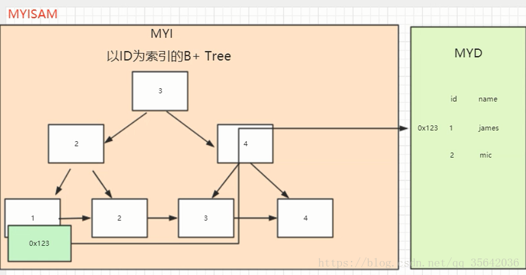
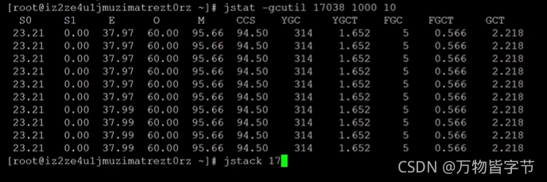

# 2022.02.14

## 计算机存储系统分为几个层次,你是如何理解分层存储的？

三级层次结构，主要由
1. **高速缓冲存储器**
2. **主存储器**
3. **辅助存储器**
组成。

## 多线程同步和互斥有几种实现方法，都是什么？

线程同步是指线程之间所具有的一种制约关系，一个线程的执行依赖另外一个线程的消息，当它没有得到另一个线程的消息时应等待，直到消息到达时才被唤醒。

线程互斥是指对于共享的进程系统资源，每个线程访问时的排他性。当有若干个线程都要使用某一个共享资源时，任何时刻最多只允许一个线程去使用，其他线程必须等待，直到占用资源者释放该资源。线程互斥可以看成是一种特殊的线程同步。

线程间的同步方法大体可以分为两类：用户模式和内核模式。

* 用户模式： 原子操作（例如一个单一的全局变量），临界区
* 内核模式： 事件、信号量、互斥量

内核模式就是利用系统内核对象的单一性来进行同步，使用时需要切换内核态与用户态，

而用户模式不需要切换内核态，只在用户态完成操作。

1. 临界区： 通过对多线程的串行化来访问公共资源或一段代码，速度快，适合控制数据访问。
2. 互斥量： 为协调共同对一个共享资源的单独访问而设计。
3. 信号量： 为控制一个具有有限数量的共享资源而设计。
4. 事件： 用来通知线程有一些事件已发生，从而启动后继任务的开始。

## mysql中innodb和myisam的区别

1. InnoDB支持事务，MyISAM不支持。
2. InnoDB支持外键，而MyISAM不支持。
3. 
   * InnoDB的B+树主键索引的叶子节点就是数据文件（聚集索引），辅助索引的叶子节点是主键的值（使用辅助索引需查找2次：①通过除主键以外的索引查询到主键的索引值，②再通过主键的索引值查找到对应的行数据。）；
   
   * MyISAM的B+树主键索引和辅助索引的叶子节点都是数据文件的地址指针，指向了真正的数据文件（无论是使用主键索引还是辅助索引都需要查找2次，一是找到地址，二是通过地址找到数据）。
   
4. 
   * InnoDB不保存表的具体行数，执行select count(*) from table时需要全表扫描。
   * 而MyISAM用一个变量保存了整个表的行数，执行上述语句时只需要读出该变量即可，速度很快（注意不能加有任何WHERE条件）
5. Innodb不支持全文索引，而MyISAM支持全文索引，在涉及全文索引领域的查询效率上MyISAM速度更快高；
   >5.7以后的InnoDB支持全文索引了。
6. MyISAM表格可以被压缩后进行查询操作。
7. InnoDB支持表、行(默认)级锁，而MyISAM支持表级锁。
   > InnoDB的行锁是实现在索引上的，而不是锁在物理行记录上。潜台词是，如果访问没有命中索引，也无法使用行锁，将要退化为表锁。
8. InnoDB表必须有唯一索引（如主键）（用户没有指定的话会自己找/生产一个隐藏列Row_id来充当默认主键），而Myisam可以没有。
9. Innodb存储文件有frm、ibd，而Myisam是frm、MYD、MYI。
   >* Innodb：frm是表定义文件，ibd是数据文件
   >* Myisam：frm是表定义文件，myd是数据文件，myi是索引文件

## InnoDB为什么推荐使用自增ID作为主键？

自增ID可以保证每次插入时B+索引是从右边扩展的，可以避免B+树和频繁合并和分裂（对比使用UUID）。如果使用字符串主键和随机主键，会使得数据随机插入，效率比较差。

 

## innodb引擎的4大特性

插入缓冲（insert buffer),二次写(double write),自适应哈希索引(ahi),预读(read ahead)

## JDK为我们提供的工具

**jps:**

列出当前机器上正在运行的虚拟机进程

-p  :仅仅显示VM 标示，不显示jar,class, main参数等信息.

-m:输出主函数传入的参数. 下的hello 就是在执行程序时从命令行输入的参数

-l: 输出应用程序主类完整package名称或jar完整名称.

-v: 列出jvm参数, -Xms20m -Xmx50m是启动程序指定的jvm参数

**jstat**

是用于监视虚拟机各种运行状态信息的命令行工具。它可以显示本地或者远程虚拟机进程中的类装载、内存、垃圾收集、JIT编译等运行数据，在没有GUI图形界面，只提供了纯文本控制台环境的服务器上，它将是运行期定位虚拟机性能问题的首选工具。

假设需要每250毫秒查询一次进程2764垃圾收集状况，一共查询20次，那命令应当是：jstat -gc 2764 250 20

常用参数：

-class (类加载器)

-compiler (JIT)

-gc (GC堆状态)

-gccapacity (各区大小)

-gccause (最近一次GC统计和原因)

-gcnew (新区统计)

-gcnewcapacity (新区大小)

-gcold (老区统计)

-gcoldcapacity (老区大小)

-gcpermcapacity (永久区大小)

-gcutil (GC统计汇总)

-printcompilation (HotSpot编译统计)

【gcutil 示例】


**jinfo**

查看和修改虚拟机的参数

jinfo –sysprops 可以查看由System.getProperties()取得的参数

jinfo –flag 未被显式指定的参数的系统默认值

jinfo –flags（注意s）显示虚拟机的参数

jinfo –flag +[参数] 可以增加参数，但是仅限于由java -XX:+PrintFlagsFinal –version查询出来且为manageable的参数

jinfo –flag -[参数] 可以去除参数

Thread.getAllStackTraces();

**jmap**

用于生成堆转储快照（一般称为heapdump或dump文件）。jmap的作用并不仅仅是为了获取dump文件，它还可以查询finalize执行队列、Java堆和永久代的详细信息，如空间使用率、当前用的是哪种收集器等。和jinfo命令一样，jmap有不少功能在Windows平台下都是受限的，除了生成dump文件的-dump选项和用于查看每个类的实例、空间占用统计的-histo选项在所有操作系统都提供之外，其余选项都只能在Linux/Solaris下使用。

1、jmap -dump:live,format=b,file=heap.bin \<pid>

Sun JDK提供jhat（JVM Heap Analysis Tool）命令与jmap搭配使用，来分析jmap生成的堆转储快照。

2、  jmap -heap pid

         查看java 堆（heap）使用情况

3、 jmap -histo pid

        查看堆内存(histogram)中的对象数量，大小

                num     #instances         #bytes  class name

                序号         实例个数            字节数       类名    

        ----------------------------------------------

         1:       3174877      107858256  [C

         2:       3171499       76115976  java.lang.String

         3:       1397884       38122240  [B

         4:        214690       37785440  com.tongli.book.form.Book

         5:        107345       18892720  com.tongli.book.form.Book

         6:         65645       13953440  [Ljava.lang.Object;

         7:         59627        7648416  

         8:        291852        7004448  java.util.HashMap$Entry

         9:        107349        6871176  [[B

         ..........

        total       9150732      353969416

**jhat**

jhat dump文件名

后屏幕显示“Server is ready.”的提示后，用户在浏览器中键入http://localhost：7000/就可以访问详情

**jstack**

（Stack Trace for Java）命令用于生成虚拟机当前时刻的线程快照。线程快照就是当前虚拟机内每一条线程正在执行的方法堆栈的集合，生成线程快照的主要目的是定位线程出现长时间停顿的原因，如线程间死锁、死循环、请求外部资源导致的长时间等待等都是导致线程长时间停顿的常见原因。

在代码中可以用java.lang.Thread类的getAllStackTraces（）方法用于获取虚拟机中所有线程的StackTraceElement对象。使用这个方法可以通过简单的几行代码就完成jstack的大部分功能，在实际项目中不妨调用这个方法做个管理员页面，可以随时使用浏览器来查看线程堆栈。

管理远程进程需要在远程程序的启动参数中增加：

-Djava.rmi.server.hostname=…..

-Dcom.sun.management.jmxremote

-Dcom.sun.management.jmxremote.port=8888

-Dcom.sun.management.jmxremote.authenticate=false

-Dcom.sun.management.jmxremote.ssl=false

**visualvm**

1：可以查看本地java进程内存，线程等 

2：可以查看远程jvm进程内存，线程等情况

3：可以分析离线dump文件

插件中心地址

https://visualvm.github.io

但是注意版本问题，不同的JDK所带的visualvm是不一样的，下载插件时需要下对应的版本。

## delete与truncate删除表中数据的区别

1. delete与truncate都可以用来删除表中数据

2. delete删除你表中数据之后，再次插入数据索引会接着之前的，而truncate删除表中后重新插入数据索引会从初始大小开始。

3. delete在删除数据后会将删除操作作为事务存储在日志中，这样就可以进行事务回滚。而 truncate则不可以事务回滚。

## MD5是不是杂凑算法

MD5即 Message-Digest Algorithm 5（信息-摘要算法5），用于确保信息传输完整一致。是计算机广泛使用的杂凑算法之一，将数据（如汉字）运算为另一固定长度值，是杂凑算法的基础原理。

MD5是输入不定长度信息，输出固定长度 128-bits 的算法。
>经过程序流程，生成四个32位数据，最后联合起来成为一个 128-bits 散列。
>基本方式为，求余、取余、调整长度、与链接变量进行循环运算，得出结果。

MD5 算法和加密算法都可以将信息转换为另外一种内容。

但是，MD5 算法对比 加密算法缺少了解密过程。

事实上，使用 加密算法加密后的消息是完整的，并且基于解密算法后，可以恢复原始数据。

而 MD5 算法得到的消息是不完整的，并且通过摘要的数据也无法得到原始数据。

所以，MD5 算法是杂凑算法，不是加密算法！

## 数组的复制

**System.arraycopy()**

```
public static void arraycopy(Object src,int srcPos,Object dest,int desPos,int length)
```

**Arrays.copyOf()**
```
public static int[] copyOf(int[] original, int newLength)
```
该方法目的应该是扩容，本质上内部还是调用了System.arraycopy()。

## 并发操作可能会产生哪几类数据不一致？用什么方法能避免各种不一致的情况？

并发操作带来的数据不一致性包括三类：
* 丢失修改
* 不可重复读
* 读“脏”数据。

1. 丢失修改（lostupdate）两个事务T1和T2读入同一数据并修改，T2提交的结果破坏了（覆盖了）T1提交的结果，导致T1的修改被丢失。
2. 不可重复读（Non一RepeatableRead）不可重复读是指事务T1读取数据后，事务T2执行更新操作，使T1无法再现前一次读取结果。
3. 读“脏”数据（DirtyRead）读“脏”数据是指事务T1修改某一数据，并将其写回磁盘，事务几读取同一数据后，T1由于某种原因被撤销，这时T1已修改过的数据恢复原值，几读到的数据就与数据库中的数据不一致，则几读到的数据就为“脏”数据，即不正确的数据。

避免不一致性的方法和技术就是并发控制。最常用的技术是封锁技术。也可以用其他技术，例如在分布式数据库系统中可以采用时间戳方法来进行并发控制。

## java对象序列化

序列化是将对象的状态信息转化为可以存储或传输的形式的过程。

Java提供的API有：
```
java.io.Serializable
java.io.Externalizable
ObjectOutput
ObjectInput
ObjectOutputStream
ObjectInputStream
```

## slf4j实现原理

slf4j是[门面模式](../../chapter3/section12/index.md)的典型应用。

https://www.cnblogs.com/xrq730/p/8619156.html

## 存储过程接受的参数是：

* IN：传入参数
* OUT：传出参数
* INOUT：传入传出参数

## PL/SQL

PL/SQL也是一种程序语言，叫做过程化SQL语言（Procedural Language/SQL）。PL/SQL是Oracle数据库对SQL语句的扩展。在普通SQL语句的使用上增加了编程语言的特点。

* 头部分
* 列外部分
* 执行部分：实现对数据的操作
* 声明部分

## 磁盘缓冲区

百度说法：磁盘的缓冲区是硬盘与外部总线交换数据的场所。

专业说法2种：
1指：在内存开辟的内存缓冲区，由程序自身所设置的一块内存空间，用来暂存从其他设备读入的数据或者是即将写入其他设备的数据；

2指：磁盘本身携带的一块随机存储区，大小通常在数MB到几十MB，这个是固化在硬盘内部的，它的作用和前一种类似，也是为了增加读写效率和保护硬盘，只是它是系统中的所有程序共享的，并且除了驱动程序外，通常的程序无法控制它。

**总结**
大多数情况下，程序不选择依赖磁盘本身携带的缓冲区，而是自己在内存占一块地方作为缓冲区。

## 解决哈希冲突的链地址算法中，关于插入新数据项的时间表述正确的是：

https://blog.csdn.net/Jasminexjf/article/details/96108729

随装载因子线性增长